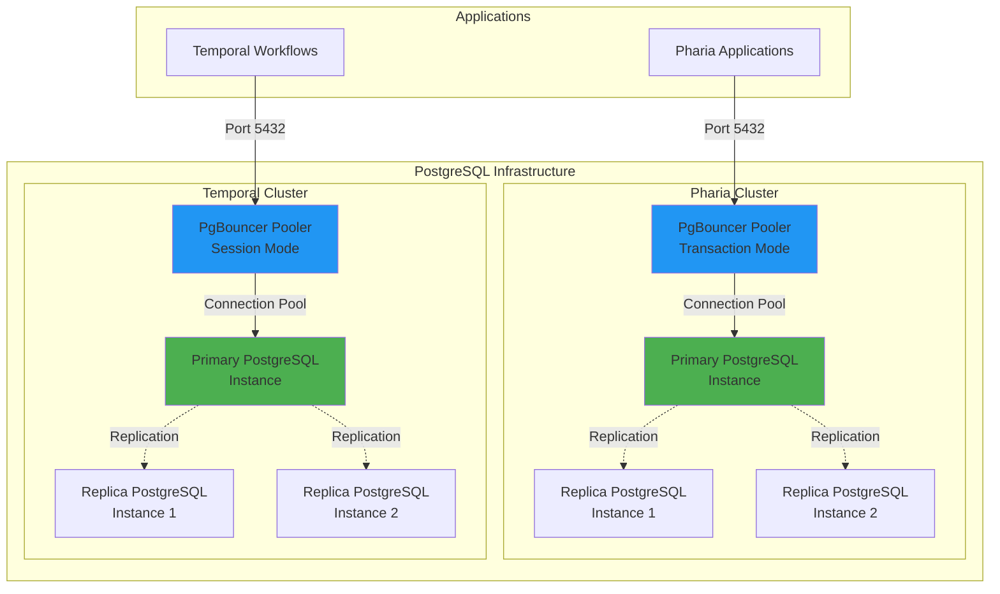

# Pharia AI Quick Start Helm Charts

This directory contains Helm charts for deploying the infrastructure components required by Pharia AI applications: PostgreSQL, Redis, and MinIO.

## Table of Contents

- [Overview](#overview)
- [PostgreSQL Setup](#postgresql-setup)
- [Redis Setup](#redis-setup)
- [MinIO Setup](#minio-setup)

---

## Overview

The Pharia AI Quick Start Helm charts in this directory provide essential **persistence and infrastructure services** that run inside your Kubernetes cluster to support the Pharia AI application stack. These charts deploy and manage:

- **PostgreSQL**: Highly available relational database clusters with connection pooling for application data persistence
- **Redis**: In-memory data stores for caching, session management, and queue processing
- **MinIO**: S3-compatible object storage for files, artifacts, and large data objects

### Purpose

These infrastructure components are designed to provide:

1. **Data Persistence**: Reliable storage for application data, configurations, and state
2. **High Availability**: Clustered deployments with automatic failover and replication
3. **Performance Optimization**: Connection pooling, caching, and efficient data access patterns
4. **Isolation**: Dedicated resources per application with proper access control
5. **Kubernetes-Native**: Fully integrated with Kubernetes using operators and custom resources
6. **Automated Secret Management**: Each chart automatically generates Kubernetes secrets containing connection credentials and endpoints

### Automated Secret Generation

**A key feature of these Helm charts is the built-in mechanism to auto-generate Kubernetes secrets** with connection data for all infrastructure services:

- **PostgreSQL Secrets**: Contain database credentials (username, password), connection endpoints (host, port), database names, and complete connection URLs for each application role
- **Redis Secrets**: Contain Redis instance credentials, hostnames, and port information for cache access
- **MinIO Secrets**: Contain S3-compatible access keys, secret keys, endpoint URLs, and bucket names for object storage

**Integration with Pharia AI Applications:**

These auto-generated secrets are designed to be **directly referenced in the `values.yaml` of the Pharia AI Helm chart** to connect Pharia applications to their respective infrastructure services. This approach provides:

- **Zero manual credential management**: No need to manually create or manage passwords and connection strings
- **Secure credential storage**: All sensitive data is stored as Kubernetes secrets
- **Consistent naming convention**: Predictable secret names following the pattern `qs-{service}-access-{application}`
- **Automatic updates**: Secrets are preserved during upgrades, ensuring connection stability
- **Ready-to-use references**: Simply reference the secret name and key in your Pharia AI application configuration

**Example Integration:**

```yaml
# In Pharia AI values.yaml - PostgreSQL Connection
document-index:
  databaseConfig:
    external:
      existingSecret: "qs-postgresql-cluster-access-document-index"
    secretKeys:
      hostKey: host
      portKey: port
      userKey: user
      passwordKey: password
      databaseNameKey: databaseName
      databaseUrlKey: databaseUrl

# Redis Connection
pharia-assistant-api:
  redisConfig:
    external:
      existingSecret: "qs-redis-pharia-assistant-api"
    secretKeys:
      hostKey: host
      portKey: port
      usernameKey: username
      passwordKey: password

# MinIO / S3 Connection
pharia-data-api:
  storageConfig:
    internalBucket:
      external:
        existingSecret: "qs-minio-access-pharia-data-internal"
      secretKeys:
        bucketNameKey: "bucket"
        bucketUserKey: "user"
        bucketPasswordKey: "password"
    externalBucket:
      external:
        existingSecret: "qs-minio-access-pharia-data-external"
      secretKeys:
        bucketNameKey: "bucket"
        bucketUserKey: "user"
        bucketPasswordKey: "password"
```

This seamless integration eliminates the need for manual credential configuration and ensures that Pharia AI applications are automatically connected to their infrastructure dependencies.

### Installation Prerequisites

**Important:** All support charts must be installed **before** deploying the Pharia AI application helm charts.

**Namespace Requirement:** Install all infrastructure components in the **same namespace** where you plan to deploy the Pharia AI stack. The default namespace used in this documentation is `pharia-ai`.

**Installation Order:**

1. **Operators First**: Install the required operators (PostgreSQL operator, Redis operator)
2. **Infrastructure Services**: Deploy the infrastructure resources (PostgreSQL clusters, Redis instances, MinIO deployments)
3. **Pharia AI Applications**: Finally, deploy the Pharia AI application helm charts

**Example Namespace Setup:**

```bash
# Create the namespace for Pharia AI and its infrastructure
kubectl create namespace pharia-ai

# Set as default namespace for convenience (optional)
kubectl config set-context --current --namespace=pharia-ai
```

**Why This Order Matters:**

- Operators must be running before their Custom Resource Definitions (CRDs) can be used
- Infrastructure services must be ready before applications attempt to connect
- Secrets generated during infrastructure deployment are required by Pharia AI applications
- Applications will fail to start if their database, cache, or storage dependencies are unavailable

The following sections detail the installation process for each infrastructure component in the recommended order.

---

## PostgreSQL Setup

The PostgreSQL setup provides a highly available database infrastructure with connection pooling via PgBouncer. It consists of two separate PostgreSQL clusters: one for Pharia applications and one for Temporal workflow engine.

### Architecture

The PostgreSQL setup uses CloudNativePG operator and includes the following components:



**Key Architecture Points:**
- **PostgreSQL Cluster:** High-availability setup with 3 instances (1 primary, 2 replicas) for automatic failover
- **PgBouncer Pooler:** Integrated connection pooler that efficiently manages database connections
  - **Transaction Mode (Pharia):** Optimized for short-lived transactions, releases connections after each transaction
  - **Session Mode (Temporal):** Maintains connection state for entire client session, required for Temporal workflows
- **Service Endpoints:** 
  - Direct cluster connection: `{cluster-name}-rw` (read-write), `{cluster-name}-r` (read-only)
  - Pooler connection: `{cluster-name}-pooler-{pooler-name}` (recommended)

### Prerequisites

The PostgreSQL operator must be installed before deploying the clusters.

#### CRD Installation

CloudNativePG requires Custom Resource Definitions (CRDs) to be installed. The Helm chart includes CRDs by default and will install them automatically. However, for production environments or when you need more control over CRD lifecycle management, you can install CRDs separately before deploying the operator.

**Option 1: Automatic CRD Installation (Default)**

CRDs are automatically included and installed with the Helm chart:

```bash
# Install CloudNativePG operator with CRDs included
helm install qs-postgresql-operator ./qs-postgresql-operator \
  --namespace pharia-ai
```

**Option 2: Manual CRD Installation (Recommended for Production)**

Install CRDs directly from the GitHub source before deploying the Helm chart. This approach gives you better control over CRD lifecycle management and allows CRD updates independent of operator upgrades.

```bash
# Set the CloudNativePG version (should match your chart dependency version)
CNPG_VERSION="0.26.1"

# Install CRDs from GitHub
kubectl apply -f https://raw.githubusercontent.com/cloudnative-pg/charts/cloudnative-pg-v${CNPG_VERSION}/charts/cloudnative-pg/templates/crds/crds.yaml

# Install operator without CRDs (since they're already installed)
helm install qs-postgresql-operator ./qs-postgresql-operator \
  --namespace pharia-ai \
  --set crds.create=false
```

**Note:** When using Option 2, ensure the CRD version matches the operator version specified in `qs-postgresql-operator/Chart.yaml` (currently v0.26.1).

Wait for the operator to be ready:

```bash
kubectl wait --for=condition=available --timeout=300s \
  deployment/qs-postgresql-operator-cloudnative-pg \
  -n pharia-ai
```

### Installation Steps

#### 1. Install PostgreSQL Clusters

```bash
helm install qs-postgresql-cluster ./qs-postgresql-cluster \
  --namespace pharia-ai
```

**What happens during installation:**

1. **Pre-install Hook (RBAC & ServiceAccount):** Creates the ServiceAccount and Role/RoleBinding for secret management
2. **Pre-install Hook (Secret Generation Job):** Executes a Kubernetes Job that:
   - Generates secure random passwords for each database role
   - Creates Kubernetes secrets with connection details (host, port, username, password, database)
   - Labels secrets for lifecycle management
   - Preserves existing passwords on upgrades
3. **Cluster Deployment:** Deploys two CloudNativePG clusters:
   - `qs-postgresql-cluster-pharia`: For Pharia applications (3 instances, transaction pooler)
   - `qs-postgresql-cluster-temporal`: For Temporal workflows (3 instances, session pooler)
4. **Role Creation:** Creates database roles (users) as specified in the cluster configuration
5. **Pooler Deployment:** Deploys PgBouncer poolers for connection management

#### 2. Install Database Resources

After the clusters are ready, install the database resources:

```bash
helm install qs-postgresql-db ./qs-postgresql-db \
  --namespace pharia-ai
```

**What happens during installation:**

1. **Database Creation:** Creates the CloudNativePG Database resources for each application
2. **Post-install Hook (Extension Job):** Executes a Job that enables PostgreSQL extensions (uuid-ossp, pgcrypto, pg_stat_statements, pg_trgm, btree_gin) in each database
3. **Post-install Hook (Isolation Job):** Enforces database isolation by revoking cross-database access

### Adding a New Database with a New Role

To add a new database with a dedicated role to the PostgreSQL cluster, you need to update both the `qs-postgresql-cluster` and `qs-postgresql-db` charts.

#### Step 1: Add the Role to the PostgreSQL Cluster

Edit the `qs-postgresql-cluster/values.yaml` file and add a new role to the appropriate cluster's `roles` section:

```yaml
clusterPharia:
  cluster:
    roles:
      # ... existing roles ...
      - name: "my_new_app"
        connectionLimit: -1
        ensure: present
        inherit: true
        passwordSecret:
          name: "qs-postgresql-cluster-access-my-new-app"
        login: true
        superuser: false
        replication: false
```

**Role Configuration:**
- **name:** The PostgreSQL role/username (use underscores, e.g., `my_new_app`)
- **connectionLimit:** Max concurrent connections (-1 = unlimited)
- **passwordSecret.name:** Secret name following the pattern `qs-postgresql-cluster-access-{role-name}`
- **login:** Set to `true` to allow the role to connect
- **superuser:** Set to `false` for application roles (security best practice)
- **replication:** Set to `false` for application roles

#### Step 2: Add the Database Resource

Edit the `qs-postgresql-db/values.yaml` file and add a new database entry:

```yaml
databases:
  # ... existing databases ...
  - name: "my-new-app"
    enabled: true
    cluster: "qs-postgresql-cluster-pharia"  # or "qs-postgresql-cluster-temporal"
    owner: "my_new_app"
    connectionLimit: 50
    extensions:
      - uuid-ossp
      - pgcrypto
      - pg_stat_statements
      - pg_trgm
      - btree_gin
```

**Database Configuration:**
- **name:** Database name (use hyphens, e.g., `my-new-app`)
- **cluster:** Target cluster name (`qs-postgresql-cluster-pharia` or `qs-postgresql-cluster-temporal`)
- **owner:** The role that owns this database (must match the role name from Step 1)
- **connectionLimit:** Max connections to this database
- **extensions:** PostgreSQL extensions to enable (optional)

#### Step 3: Apply the Changes

Upgrade the Helm releases to apply the changes:

```bash
# Update the cluster to add the new role
helm upgrade qs-postgresql-cluster ./qs-postgresql-cluster \
  --namespace pharia-ai

# Update the database resources to create the new database
helm upgrade qs-postgresql-db ./qs-postgresql-db \
  --namespace pharia-ai
```

#### What Happens During the Upgrade:

1. **Secret Generation:** A pre-upgrade hook creates a new secret `qs-postgresql-cluster-access-my-new-app` with:
   - Random password
   - Connection details (host, port)
   - Database connection URL
   
2. **Role Creation:** CloudNativePG operator creates the new PostgreSQL role with the password from the secret

3. **Database Creation:** The Database CRD creates the new database owned by the role

4. **Extension Enablement:** A post-upgrade job enables the specified PostgreSQL extensions in the new database

5. **Pooler Configuration:** The role is automatically configured to use the default pooler (or can be customized in `config.rolePoolerMappings`)

#### Step 4: Verify the New Database

Test the new database connection:

```bash
# Run Helm tests to verify connectivity
helm test qs-postgresql-cluster -n pharia-ai
helm test qs-postgresql-db -n pharia-ai

# Check that the secret was created
kubectl get secret qs-postgresql-cluster-access-my-new-app -n pharia-ai

# Verify the database exists
kubectl get database my-new-app -n pharia-ai
```

#### Connection Information for Applications

After the upgrade, applications can connect to the new database using the generated secret:

```yaml
# Example: Use the secret in an application deployment
env:
  - name: DB_HOST
    valueFrom:
      secretKeyRef:
        name: qs-postgresql-cluster-access-my-new-app
        key: host
  - name: DB_PORT
    valueFrom:
      secretKeyRef:
        name: qs-postgresql-cluster-access-my-new-app
        key: port
  - name: DB_USERNAME
    valueFrom:
      secretKeyRef:
        name: qs-postgresql-cluster-access-my-new-app
        key: username
  - name: DB_PASSWORD
    valueFrom:
      secretKeyRef:
        name: qs-postgresql-cluster-access-my-new-app
        key: password
  - name: DB_NAME
    valueFrom:
      secretKeyRef:
        name: qs-postgresql-cluster-access-my-new-app
        key: databaseName
  # Or use the complete connection URL
  - name: DATABASE_URL
    valueFrom:
      secretKeyRef:
        name: qs-postgresql-cluster-access-my-new-app
        key: databaseUrl
```

### Pharia Application Connections

The PostgreSQL setup supports the following Pharia applications and components:

#### Pharia Cluster Applications

| Application | Database | User | Pooler Mode |
|------------|----------|------|-------------|
| Document Index | `document-index` | `document_index` | Transaction |
| Pharia OS | `pharia-os` | `pharia_os` | Transaction |
| Inference API | `inference-api` | `inference_api` | Transaction |
| Pharia Studio | `pharia-studio` | `pharia_studio` | Transaction |
| OAuth Gateway | `pharia-oauth-gateway` | `pharia_oauth_gateway` | Transaction |
| Pharia Assistant | `pharia-assistant` | `pharia_assistant` | Transaction |
| Pharia Chat | `pharia-chat` | `pharia_chat` | Transaction |
| Pharia Catch | `pharia-catch` | `pharia_catch` | Transaction |
| Pharia Conductor | `pharia-conductor` | `pharia_conductor` | Transaction |
| Pharia Numinous | `pharia-numinous` | `pharia_numinous` | Transaction |
| Pharia Transcribe | `pharia-transcribe-app` | `pharia_transcribe_app` | Transaction |
| Pharia Data | `pharia-data` | `pharia_data` | Transaction |
| Zitadel | `zitadel` | `zitadel` | Transaction |
| OpenFGA | `openfga` | `openfga` | Transaction |
| Dex | `dex` | `dex` | Transaction |
| MLflow | `mlflow` | `mlflow` | Transaction |

#### Temporal Cluster Applications

| Application | Database | User | Pooler Mode |
|------------|----------|------|-------------|
| Temporal | `temporal` | `temporal` | Session |
| Temporal Visibility | `temporal-visibility` | `temporal_visibility` | Session |

**Connection Configuration:**
- Applications use the pooler endpoints by default (configured via `config.defaultPooler`)
- Secrets automatically contain the correct connection endpoint based on role-pooler mappings
- Applications can connect using the credentials from their respective secrets

### Secret Content

The secret generation job creates Kubernetes secrets for each database role with the following keys:

```yaml
apiVersion: v1
kind: Secret
metadata:
  name: qs-postgresql-cluster-access-{role-name}
  labels:
    app.kubernetes.io/managed-by: Helm
    qs-postgresql-cluster/name: {cluster-name}
    qs-postgresql-cluster/type: access-secret
type: Opaque
data:
  username: {base64-encoded-username}
  user: {base64-encoded-username}      # Alias for username
  password: {base64-encoded-password}  # 25-character random password
  host: {base64-encoded-host}          # Pooler or direct endpoint
  port: {base64-encoded-port}          # Default: 5432
  protocol: {base64-encoded-protocol}  # Default: postgres
  databaseName: {base64-encoded-database}
  databaseUrl: {base64-encoded-url}    # Complete connection URL
```

**Secret Details:**
- **username / user:** Matches the role name (e.g., `pharia_os`, `document_index`). Both keys contain the same value for compatibility.
- **password:** 25-character cryptographically secure random password (preserved across upgrades)
- **host:** Connection endpoint based on role-pooler mapping:
  - Pooler: `{cluster-name}-pooler-{pooler-name}` (e.g., `qs-postgresql-cluster-pharia-pooler-transaction`)
  - Direct: `{cluster-name}-rw` (e.g., `qs-postgresql-cluster-pharia-rw`)
- **port:** PostgreSQL port (default: 5432)
- **protocol:** Connection protocol (default: `postgres`)
- **databaseName:** The database name the user has access to
- **databaseUrl:** Complete PostgreSQL connection string in format: `postgres://{username}:{password}@{host}:{port}/{database}`

**Password Generation:**
- Passwords are generated using OpenSSL: `openssl rand -base64 32 | tr -d "=+/" | cut -c1-25`
- Existing passwords are preserved during helm upgrades
- Each role has a unique password

### Verification

You can verify the PostgreSQL setup using Helm tests:

```bash
# Test the PostgreSQL cluster connectivity
helm test qs-postgresql-cluster -n pharia-ai

# Test the database resources
helm test qs-postgresql-db -n pharia-ai
```

**What the tests verify:**
- PostgreSQL cluster is ready and accepting connections
- All poolers (transaction/session mode) are operational
- Each database role can authenticate successfully
- Roles can connect via their configured endpoint (pooler or direct)
- Roles can connect via all available endpoints (direct cluster, transaction pooler, session pooler)
- Secret configuration matches the role-pooler mappings
- Basic SQL queries execute successfully
- Database extensions are enabled correctly
- Database isolation is enforced

**Test Output Example:**
```
════════════════════════════════════════════════════════════════
  PostgreSQL Cluster Connection Test
  Cluster: Pharia
════════════════════════════════════════════════════════════════

✅ PostgreSQL cluster (direct) is ready
✅ Pooler (transaction mode) is ready

  Testing User: pharia_os
━━━━━━━━━━━━━━━━━━━━━━━━━━━━━━━━━━━━━━━━━━━━━━━━━━━━━━━━━━━━━━
  Test 0: Secret Configuration Validation
━━━━━━━━━━━━━━━━━━━━━━━━━━━━━━━━━━━━━━━━━━━━━━━━━━━━━━━━━━━━━━
  Expected host: qs-postgresql-cluster-pharia-pooler-transaction
  Secret host:   qs-postgresql-cluster-pharia-pooler-transaction
  ✅ PASS - Secret contains correct host based on config
  📍 Role uses default pooler

━━━━━━━━━━━━━━━━━━━━━━━━━━━━━━━━━━━━━━━━━━━━━━━━━━━━━━━━━━━━━━
  Connection: Configured Endpoint (from secret)
  Host: qs-postgresql-cluster-pharia-pooler-transaction
  User: pharia_os
━━━━━━━━━━━━━━━━━━━━━━━━━━━━━━━━━━━━━━━━━━━━━━━━━━━━━━━━━━━━━━
  Test 1: Basic connectivity... ✅ PASS
  Test 2: User verification... ✅ PASS
  Test 3: Query execution... ✅ PASS
  Summary: 3 passed, 0 failed

✅ All tests passed successfully!
```

### Uninstall Process

To uninstall the PostgreSQL setup:

```bash
# Uninstall database resources first
helm uninstall qs-postgresql-db -n pharia-ai

# Uninstall PostgreSQL clusters
helm uninstall qs-postgresql-cluster -n pharia-ai

# Optional: Uninstall the operator (if no other clusters depend on it)
helm uninstall qs-postgresql-operator -n pharia-ai
```

**Important Notes:**
- By default, secrets are **retained** after uninstall (`secretCleanup.retainOnDelete: true`)
- Database data (PVCs) are retained by default according to the cluster's reclaim policy
- To automatically delete secrets on uninstall, set `secretCleanup.retainOnDelete: false`

#### Activating Secret Cleanup

To enable automatic secret deletion on uninstall:

**Option 1: Set during installation**
```bash
helm install qs-postgresql-cluster ./qs-postgresql-cluster \
  --namespace pharia-ai \
  --set secretCleanup.retainOnDelete=false
```

**Option 2: Update existing installation**
```bash
helm upgrade qs-postgresql-cluster ./qs-postgresql-cluster \
  --namespace pharia-ai \
  --set secretCleanup.retainOnDelete=false \
  --reuse-values
```

**What happens when secret cleanup is enabled:**
1. A pre-delete hook Job is executed before uninstallation
2. The Job identifies all secrets with labels:
   - `qs-postgresql-cluster/name={cluster-name}`
   - `qs-postgresql-cluster/type=access-secret`
3. All matching secrets are deleted
4. The cleanup job removes itself after completion

**Warning:** Enable secret cleanup only if you're sure you want to delete all database credentials. This action is irreversible.

### Using Existing Kubernetes Roles

If your cluster has security policies that prevent automatic RBAC resource creation, or if you prefer to manage RBAC separately, you can use existing Kubernetes Roles.

#### Prerequisites

Create a Role with the required permissions:

```yaml
apiVersion: rbac.authorization.k8s.io/v1
kind: Role
metadata:
  name: my-existing-postgresql-role
  namespace: pharia-ai
rules:
  - apiGroups: [""]
    resources: ["secrets"]
    verbs: ["get", "list", "create", "update", "patch", "delete"]
```

Create a ServiceAccount (if not already existing):

```yaml
apiVersion: v1
kind: ServiceAccount
metadata:
  name: my-existing-serviceaccount
  namespace: pharia-ai
```

Create a RoleBinding:

```yaml
apiVersion: rbac.authorization.k8s.io/v1
kind: RoleBinding
metadata:
  name: my-postgresql-rolebinding
  namespace: pharia-ai
roleRef:
  apiGroup: rbac.authorization.k8s.io
  kind: Role
  name: my-existing-postgresql-role
subjects:
  - kind: ServiceAccount
    name: my-existing-serviceaccount
    namespace: pharia-ai
```

#### Installation with Existing RBAC

Install the chart using existing RBAC resources:

```bash
helm install qs-postgresql-cluster ./qs-postgresql-cluster \
  --namespace pharia-ai \
  --set rbac.create=false \
  --set rbac.roleName=my-existing-postgresql-role \
  --set serviceAccount.create=false \
  --set serviceAccount.name=my-existing-serviceaccount
```

**Configuration Parameters:**
- `rbac.create=false`: Disables automatic Role creation
- `rbac.roleName`: Name of the existing Role to use
- `serviceAccount.create=false`: Disables automatic ServiceAccount creation
- `serviceAccount.name`: Name of the existing ServiceAccount to use

---

## Redis Setup

The Redis setup provides standalone Redis instances for Pharia applications using the Redis Operator.

### Prerequisites

The Redis operator must be installed before deploying Redis instances:

```bash
# Install Redis operator
helm install qs-redis-operator ./qs-redis-operator \
  --namespace pharia-ai
```

Wait for the operator to be ready:

```bash
kubectl wait --for=condition=available --timeout=300s \
  deployment/qs-redis-operator-redis-operator \
  -n pharia-ai
```

### Installation Steps

#### Install Redis Instances

```bash
helm install qs-redis ./qs-redis \
  --namespace pharia-ai
```

**What happens during installation:**

1. **Pre-install Hook (RBAC & ServiceAccount):** Creates the ServiceAccount and Role/RoleBinding for secret management
2. **Pre-install Hook (Secret Generation Job):** Executes a Kubernetes Job that:
   - Generates secure random passwords for each Redis instance
   - Creates Kubernetes secrets with connection details (host, port, username, password)
   - Labels secrets for lifecycle management
   - Preserves existing passwords on upgrades
3. **Redis Instance Deployment:** Deploys Redis standalone instances as Custom Resources (Redis CRD)
4. **Operator Processing:** The Redis operator creates the actual Redis StatefulSets and Services

### Supported Applications

The Redis setup provides the following instances for Pharia applications:

| Instance | Secret Name | Application | Description |
|----------|-------------|-------------|-------------|
| `qs-pharia-assistant-api-redis` | `qs-redis-pharia-assistant-api` | Pharia Assistant API | Session storage and caching for assistant service |
| `qs-pharia-transcribe-app-redis` | `qs-redis-pharia-transcribe-app` | Pharia Transcribe App | Queue management for transcription jobs |

**Connection Configuration:**
- **Host:** `{instance-name}` (e.g., `qs-pharia-assistant-api-redis`)
- **Port:** 6379 (default Redis port)
- **Username:** `default` (Redis default user)
- **Authentication:** Password-based authentication enabled

### Secret Content

The secret generation job creates Kubernetes secrets for each Redis instance with the following keys:

```yaml
apiVersion: v1
kind: Secret
metadata:
  name: qs-redis-{application-name}
  labels:
    app.kubernetes.io/managed-by: Helm
    qs-redis/instance: {instance-name}
    qs-redis/type: redis-secret
type: Opaque
data:
  host: {base64-encoded-host}          # Redis service name
  port: {base64-encoded-port}          # Default: 6379
  username: {base64-encoded-username}  # Default: "default"
  password: {base64-encoded-password}  # 25-character random password
```

**Secret Details:**
- **Host:** Redis service DNS name within the cluster
- **Port:** Redis port (default: 6379)
- **Username:** Redis username (default: `default`)
- **Password:** 25-character cryptographically secure random password (preserved across upgrades)

**Password Generation:**
- Passwords are generated using OpenSSL: `openssl rand -base64 32 | tr -d "=+/" | cut -c1-25`
- Existing passwords are preserved during helm upgrades
- Each Redis instance has a unique password

### Verification

You can verify the Redis setup using Helm tests:

```bash
# Test Redis connectivity
helm test qs-redis -n pharia-ai
```

**What the tests verify:**
- Redis instances are ready and accepting connections
- Authentication with password works correctly
- Basic Redis commands (PING, SET, GET) execute successfully
- Each instance is accessible from within the cluster

**Test Output Example:**
```
Testing Redis instance: qs-pharia-assistant-api-redis
✅ Redis is ready
✅ Authentication successful
✅ PING command: PONG
✅ SET/GET commands working

Testing Redis instance: qs-pharia-transcribe-app-redis
✅ Redis is ready
✅ Authentication successful
✅ PING command: PONG
✅ SET/GET commands working

All Redis instances are healthy!
```

### Uninstall Process

To uninstall the Redis setup:

```bash
# Uninstall Redis instances
helm uninstall qs-redis -n pharia-ai

# Optional: Uninstall the operator (if no other instances depend on it)
helm uninstall qs-redis-operator -n pharia-ai
```

**Important Notes:**
- By default, secrets are **retained** after uninstall (`secretCleanup.retainOnDelete: true`)
- Redis data (PVCs) may be retained depending on the Redis instance's storage configuration
- To automatically delete secrets on uninstall, set `secretCleanup.retainOnDelete: false`

#### Activating Secret Cleanup

To enable automatic secret deletion on uninstall:

**Option 1: Set during installation**
```bash
helm install qs-redis ./qs-redis \
  --namespace pharia-ai \
  --set secretCleanup.retainOnDelete=false
```

**Option 2: Update existing installation**
```bash
helm upgrade qs-redis ./qs-redis \
  --namespace pharia-ai \
  --set secretCleanup.retainOnDelete=false \
  --reuse-values
```

**What happens when secret cleanup is enabled:**
1. A pre-delete hook Job is executed before uninstallation
2. The Job identifies all secrets with labels:
   - `qs-redis/type=redis-secret`
3. All matching secrets are deleted
4. The cleanup job removes itself after completion

### Using Existing Kubernetes Roles

If your cluster has security policies that prevent automatic RBAC resource creation, you can use existing Kubernetes Roles.

#### Prerequisites

Create a Role with the required permissions:

```yaml
apiVersion: rbac.authorization.k8s.io/v1
kind: Role
metadata:
  name: my-existing-redis-role
  namespace: pharia-ai
rules:
  - apiGroups: [""]
    resources: ["secrets"]
    verbs: ["get", "list", "create", "update", "patch", "delete"]
```

Create a ServiceAccount and RoleBinding as shown in the PostgreSQL section.

#### Installation with Existing RBAC

```bash
helm install qs-redis ./qs-redis \
  --namespace pharia-ai \
  --set rbac.create=false \
  --set rbac.roleName=my-existing-redis-role \
  --set serviceAccount.create=false \
  --set serviceAccount.name=my-existing-serviceaccount
```

---

## MinIO Setup

The MinIO setup provides S3-compatible object storage for Pharia applications.

### Prerequisites

No operator installation required. MinIO instances run as standalone deployments.

### Installation Steps

#### Install MinIO Instances

```bash
helm install qs-minio ./qs-minio \
  --namespace pharia-ai
```

**What happens during installation:**

1. **Pre-install Hook (RBAC & ServiceAccount):** Creates the ServiceAccount and Role/RoleBinding for secret management
2. **Pre-install Hook (Secret Generation Job):** Executes a Kubernetes Job that:
   - Generates secure random credentials for each MinIO instance
   - Creates Kubernetes secrets with access credentials (user, password, host, port)
   - Labels secrets for lifecycle management
   - Preserves existing credentials on upgrades
3. **MinIO Instance Deployment:** Deploys MinIO StatefulSets with the specified bucket configuration
4. **Bucket Creation:** MinIO automatically creates the configured buckets on first startup

### Supported Applications

The MinIO setup provides the following instances for Pharia applications:

| Instance | Secret Name | Buckets | Application | Description |
|----------|-------------|---------|-------------|-------------|
| `qs-minio-pharia-data` | `qs-minio-access-pharia-data` | `internal`, `external` | Pharia Data | General data storage |
| `qs-minio-pharia-finetuning` | `qs-minio-access-pharia-finetuning` | `pharia-finetuning` | Pharia Finetuning | ML model finetuning artifacts |

**Connection Configuration:**
- **Protocol:** HTTP (configurable via `minio.protocol`)
- **Port:** 9000 (default MinIO API port)
- **Endpoint:** `{instance-name}:{port}` (e.g., `qs-minio-pharia-data:9000`)
- **Access Style:** Path-style (e.g., `http://qs-minio-pharia-data:9000/bucket-name/object-key`)

### Secret Content

The secret generation job creates two types of Kubernetes secrets for each MinIO instance:

#### 1. MinIO Instance Secret

A main secret for accessing the entire MinIO instance:

```yaml
apiVersion: v1
kind: Secret
metadata:
  name: qs-minio-access-{application-name}
  labels:
    app.kubernetes.io/managed-by: Helm
    qs-minio/instance: {instance-name}
    qs-minio/type: access-secret
type: Opaque
data:
  user: {base64-encoded-username}           # e.g., "pharia-data"
  password: {base64-encoded-password}       # 25-character random password
  endpointUrl: {base64-encoded-endpoint}    # Complete endpoint URL
```

**Example:** `qs-minio-access-pharia-data` provides access to the entire MinIO instance

#### 2. Bucket-Specific Secrets

Additional secrets created for each configured bucket, containing the same credentials plus the bucket name:

```yaml
apiVersion: v1
kind: Secret
metadata:
  name: qs-minio-access-{application-name}-{bucket-name}
  labels:
    app.kubernetes.io/managed-by: Helm
    qs-minio/instance: {instance-name}
    qs-minio/type: access-secret
type: Opaque
data:
  user: {base64-encoded-username}           # Same as instance secret
  password: {base64-encoded-password}       # Same as instance secret
  endpointUrl: {base64-encoded-endpoint}    # Same as instance secret
  bucket: {base64-encoded-bucket}           # Specific bucket name
```

**Examples:**
- `qs-minio-access-pharia-data-internal` → for the `internal` bucket
- `qs-minio-access-pharia-data-external` → for the `external` bucket
- `qs-minio-access-pharia-finetuning-pharia-finetuning` → for the `pharia-finetuning` bucket

#### Secret Key Details:
- **user:** MinIO access key / username (e.g., `pharia-data`, `pharia-finetuning`)
- **password:** MinIO secret key - 25-character cryptographically secure random password (preserved across upgrades)
- **endpointUrl:** Complete MinIO endpoint URL in format `protocol://host:port` (e.g., `http://qs-minio-pharia-data:9000`)
- **bucket:** Specific bucket name - only present in bucket-specific secrets, allows applications to know exactly which bucket to use

**Password Generation:**
- Passwords are generated using OpenSSL: `openssl rand -base64 32 | tr -d "=+/" | cut -c1-25`
- Existing passwords are preserved during helm upgrades
- Each MinIO instance has unique credentials

### Verification

You can verify the MinIO setup using Helm tests:

```bash
# Test MinIO connectivity
helm test qs-minio -n pharia-ai
```

**What the tests verify:**
- MinIO instances are ready and accepting connections
- Authentication with access credentials works correctly
- Configured buckets exist and are accessible
- Basic S3 operations (list buckets, upload/download objects) work correctly
- Each instance is accessible from within the cluster

**Test Output Example:**
```
Testing MinIO instance: qs-minio-pharia-data
✅ MinIO is ready
✅ Authentication successful
✅ Buckets exist: internal, external
✅ Upload/download test successful

Testing MinIO instance: qs-minio-pharia-finetuning
✅ MinIO is ready
✅ Authentication successful
✅ Buckets exist: pharia-finetuning
✅ Upload/download test successful

All MinIO instances are healthy!
```

### Uninstall Process

To uninstall the MinIO setup:

```bash
# Uninstall MinIO instances
helm uninstall qs-minio -n pharia-ai
```

**Important Notes:**
- By default, secrets are **retained** after uninstall (`secretCleanup.retainOnDelete: true`)
- MinIO data (PVCs) are retained by default according to the storage class reclaim policy
- To automatically delete secrets on uninstall, set `secretCleanup.retainOnDelete: false`
- **Warning:** Uninstalling MinIO will delete all stored objects unless you have backups

#### Activating Secret Cleanup

To enable automatic secret deletion on uninstall:

**Option 1: Set during installation**
```bash
helm install qs-minio ./qs-minio \
  --namespace pharia-ai \
  --set secretCleanup.retainOnDelete=false
```

**Option 2: Update existing installation**
```bash
helm upgrade qs-minio ./qs-minio \
  --namespace pharia-ai \
  --set secretCleanup.retainOnDelete=false \
  --reuse-values
```

**What happens when secret cleanup is enabled:**
1. A pre-delete hook Job is executed before uninstallation
2. The Job identifies all secrets with labels:
   - `qs-minio/type=access-secret`
3. All matching secrets are deleted
4. The cleanup job removes itself after completion

### Using Existing Kubernetes Roles

If your cluster has security policies that prevent automatic RBAC resource creation, you can use existing Kubernetes Roles.

#### Prerequisites

Create a Role with the required permissions:

```yaml
apiVersion: rbac.authorization.k8s.io/v1
kind: Role
metadata:
  name: my-existing-minio-role
  namespace: pharia-ai
rules:
  - apiGroups: [""]
    resources: ["secrets"]
    verbs: ["get", "list", "create", "update", "patch", "delete"]
```

Create a ServiceAccount and RoleBinding as shown in the PostgreSQL section.

#### Installation with Existing RBAC

```bash
helm install qs-minio ./qs-minio \
  --namespace pharia-ai \
  --set rbac.create=false \
  --set rbac.roleName=my-existing-minio-role \
  --set serviceAccount.create=false \
  --set serviceAccount.name=my-existing-serviceaccount
```

---

## Additional Notes

### Secret Management Best Practices

1. **Backup Secrets:** Always backup secrets before upgrading or uninstalling:
   ```bash
   kubectl get secrets -n pharia-ai -l app.kubernetes.io/managed-by=Helm -o yaml > secrets-backup.yaml
   ```

2. **Rotate Passwords:** To rotate a password, delete the secret and run helm upgrade:
   ```bash
   kubectl delete secret qs-postgresql-cluster-access-pharia-os -n pharia-ai
   helm upgrade qs-postgresql-cluster ./qs-postgresql-cluster -n pharia-ai
   ```

3. **External Secrets:** For production environments, consider using external secret management solutions (e.g., HashiCorp Vault, AWS Secrets Manager) instead of Kubernetes secrets

### Monitoring and Troubleshooting

**Check operator status:**
```bash
# Check PostgreSQL operator
kubectl get pods -n pharia-ai -l app.kubernetes.io/name=cloudnative-pg

# Check Redis operator
kubectl get pods -n pharia-ai -l app.kubernetes.io/name=redis-operator
```

**View cluster status:**
```bash
kubectl get clusters -n pharia-ai
kubectl get redis -n pharia-ai
```

**Check secret generation job logs:**
```bash
kubectl logs -n pharia-ai -l app.kubernetes.io/component=create-secrets
```

**View connection details from secrets:**
```bash
kubectl get secret qs-postgresql-cluster-access-pharia-os -n pharia-ai -o jsonpath='{.data.host}' | base64 -d
```
